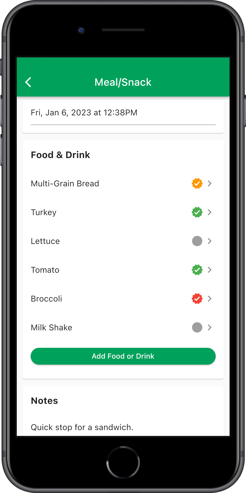
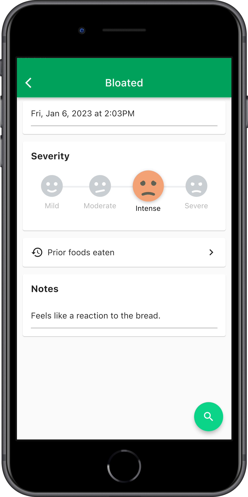
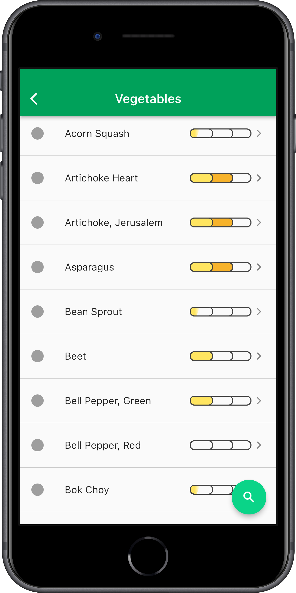
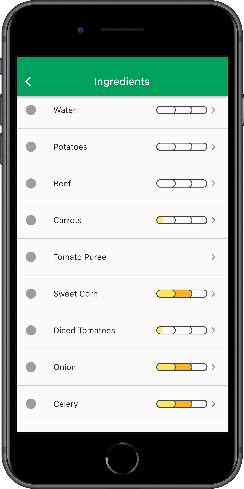
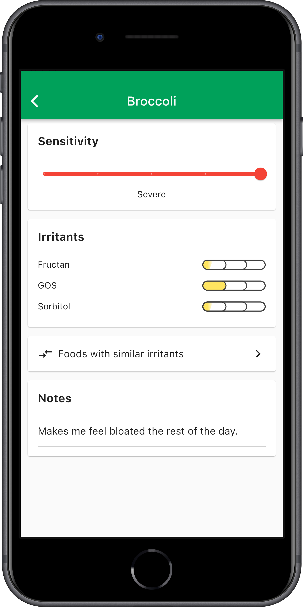
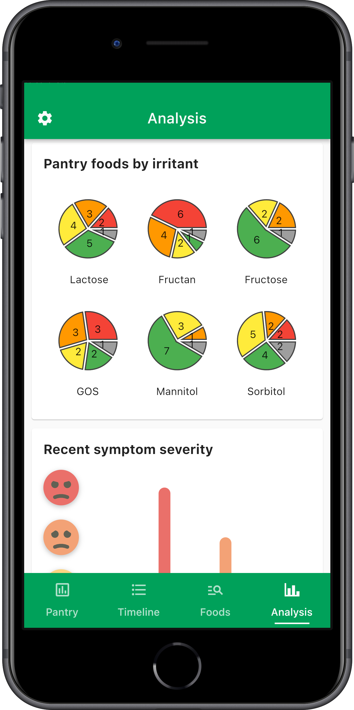

# Gut Logic

Gut Logic was a mobile applications to help people identify and manage their food sensitivities, especially FODMAP foods. The company has wound down and the app is no longer available, but we decided to open source the code for the community. Hopefully it provides a useful reference as an end-to-end example of a Flutter app with a server backend.

## Application Overview

### Timeline

The timeline allows users to track their symptoms, food, and other factors that may be related to their food sensitivities. Users can add entries to the timeline, view their history, and see trends over time.

<p float="left">
  
   
   
</p>

### Food Library

The food library allows users to search for foods and view their nutritional information. Foods with FODMAP data have a severity indicator. Foods with ingredients have a severity that is computed from its ingredients. Users can also add foods to their personal library for easy access.

<p float="left">
  
   


### Analysis

The analysis page shows users their symptom history and how it correlates with their food and other factors. Users can view their history, see trends over time, and identify potential triggers.

<p float="left">
  
  

## Architecture Overview

### Frontend

The frontend is a Flutter application that runs on iOS and Android. It is written in Dart and uses the Flutter framework. The app uses the BLoC pattern for state management and communicates with the server using REST APIs. The application is built using GitLab CI/CD and deployed to the App Store and Google Play Store. (Note: CI/CD does not work since the project was open sourced because the secrets have been deleted.)

### Backend

The backend runs on GCP. All user data is stored in Firestore. The server is written in Node.js and uses Express.js for the API. The server is deployed using GitLab CI/CD and runs on Google Cloud Run. Firestore Functions are used for background tasks and triggers. These, too, are deployed using GitLab CI/CD.

The application uses the [Edamam API](https://developer.edamam.com/food-database-api) for food data. The FODMAP irritant data in `server/api/data/irritants.sqlite3` was extracted from various publications, principally from Monash University. That database contains all references. No data was illegally copied from the Monash University app.

Initially the backend was developed as a set of independent microservices. However, as the project was getting off the ground with few users, we decided to consolidate the services into a single monolithic server to reduce costs.

## Setup

### Screenshots

To generate screenshots, run the command:

```bash
cd client
dart run bin/screenshots.dart
```

### Continuous Integration / Continuous Deployment

To build for iOS, GitLab Runner must run on MacOS. Set up a
[local runner](https://docs.gitlab.com/runner/install/osx.html) for these
builds. It expects the following resources (that are not installed by default)
to be installed globally:

- [flutter](https://flutter.dev/docs/get-started/install)
- [fastlane](https://docs.fastlane.tools/getting-started/ios/setup/)
- [lcov](https://formulae.brew.sh/formula/lcov)

## Deployment

To deploy the app and server create a branch that begins with "release", e.g.
`release/1.2`. The project will be tested, build, and automatically deployed for
beta testing. The `client:deploy:ios:release` job must be manually run to deploy
the app to the App Store.
